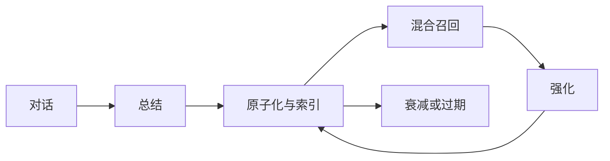

<strong>中文</strong> &nbsp;/&nbsp; <a href="README_en.md">English</a> &nbsp;/&nbsp; <a href="README_ru.md">Русский</a>

<h1>LivingMemory</h1>

<strong>为 AstrBot 构建的长期记忆：精准召回，并在每次对话中持续演化。</strong>

捕获 &nbsp;&nbsp; 检索 &nbsp;&nbsp; 连接 &nbsp;&nbsp; 演化

  
  
  
  

## 让记忆形成结构

<table>
<tr>
<td width="33%"><strong>精准召回</strong>  BM25 与向量检索同时覆盖文档路和图路，最终通过融合排序收敛为可靠结果。</td>
<td width="33%"><strong>动态上下文</strong>  事实被拆分为独立记忆原子，分别拥有重要度、TTL、强化机制与时间衰减。</td>
<td width="33%"><strong>全量可见</strong>  通过社区结构与多级细节，在高性能画布中探索完整的记忆关系图谱。</td>
</tr>
</table>

## 一套完整的记忆系统

| 召回 | 智能 | 控制 |
| :--- | :--- | :--- |
| **混合检索** 关键词与语义检索覆盖两条数据路径。 | **双通道总结** 事实信息与人格上下文保持独立价值。 | **安全操作** 自动备份、事务删除与重建失败回滚。 |
| **Agent 原生工具** `recall_long_term_memory` 与 `memorize_long_term_memory`。 | **时间感知图谱** 关系置信度随证据累积或消退动态变化。 | **专注的管理界面** 管理记忆、调试召回并检查完整图谱。 |

## 近期能力

| 可恢复记忆 | 可控边界 | 在线维护 |
| :--- | :--- | :--- |
| **原文与归档** 重要记忆可保留来源消息，支持核验、重新总结；低价值记忆可归档并恢复，而非直接删除。 | **作用域与访问控制** 可按会话、用户或全局共享记忆，并通过强制隔离、白名单和身份别名明确边界。 | **安全索引重建** 启动检查和大规模修复在后台运行，使用分批重建、进度状态、失败回滚和影子索引切换。 |

## 三步开始

1. 从 AstrBot 插件市场安装，或将插件放入 `data/plugins`。
2. 重载 AstrBot，进入 LivingMemory 配置页面。
3. 选择下方两个 Provider；其余配置均提供实用默认值。

| 配置项 | 用途 |
| :--- | :--- |
| `embedding_provider_id` | 嵌入模型；留空则使用 AstrBot 默认配置。 |
| `llm_provider_id` | 总结模型；留空则使用 AstrBot 默认配置。 |

可视化工作区入口为 `插件 -> LivingMemory -> Pages -> dashboard`。插件 Pages 需要 **AstrBot 4.24.2 或更高版本**。

## 深入了解

| 入门 | 配置 | 使用 | 原理 |
| :--- | :--- | :--- | :--- |
| [快速开始](https://lxfight-s-astrbot-plugins.github.io/astrbot_plugin_livingmemory/guide/getting-started) [功能全览](https://lxfight-s-astrbot-plugins.github.io/astrbot_plugin_livingmemory/features) | [完整配置](https://lxfight-s-astrbot-plugins.github.io/astrbot_plugin_livingmemory/configuration) | [命令列表](https://lxfight-s-astrbot-plugins.github.io/astrbot_plugin_livingmemory/commands) [WebUI 管理](https://lxfight-s-astrbot-plugins.github.io/astrbot_plugin_livingmemory/webui) | [技术架构](https://lxfight-s-astrbot-plugins.github.io/astrbot_plugin_livingmemory/architecture) |

从 v1.4.0-v1.4.2 升级？请先检查[备份、迁移与清理配置](https://lxfight-s-astrbot-plugins.github.io/astrbot_plugin_livingmemory/configuration#备份迁移与清理)。

## 项目

[完整文档](https://lxfight-s-astrbot-plugins.github.io/astrbot_plugin_livingmemory/) · [版本发布](https://github.com/lxfight-s-Astrbot-Plugins/astrbot_plugin_livingmemory/releases) · [更新记录](CHANGELOG.md) · [问题反馈](https://github.com/lxfight-s-Astrbot-Plugins/astrbot_plugin_livingmemory/issues)

社区支持：[QQ 群 953245617](https://qm.qq.com/cgi-bin/qm/qr?k=WdyqoP-AOEXqGAN08lOFfVSguF2EmBeO&jump_from=webapi&authKey=tPyfv90TVYSGVhbAhsAZCcSBotJuTTLf03wnn7/lQZPUkWfoQ/J8e9nkAipkOzwh) · 口令：`lxfight`

LivingMemory 使用 [AGPL-3.0 许可证](LICENSE)发布。
