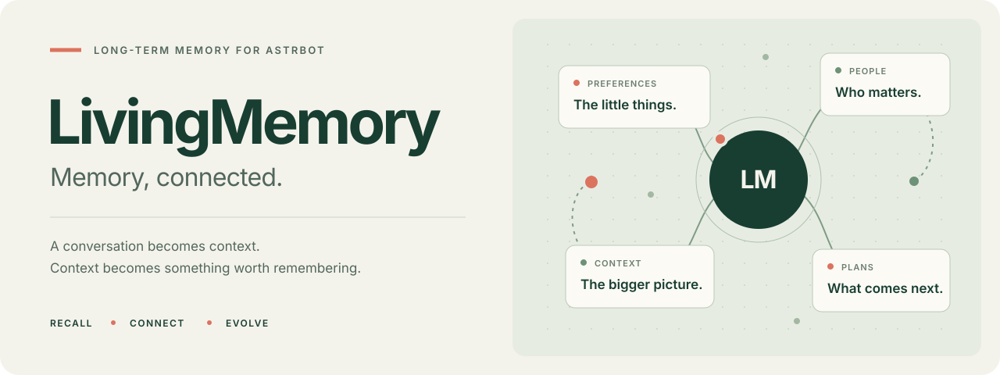

  <strong>中文</strong> · <a href="README_en.md">English</a> · <a href="README_ru.md">Русский</a>

  <a href="https://lxfight-s-astrbot-plugins.github.io/astrbot_plugin_livingmemory/"><strong>使用文档</strong></a> ·
  <a href="https://lxfight-s-astrbot-plugins.github.io/astrbot_plugin_livingmemory/webui"><strong>管理界面</strong></a> ·
  <a href="https://github.com/lxfight-s-Astrbot-Plugins/astrbot_plugin_livingmemory/releases"><strong>版本下载</strong></a> ·
  <a href="https://github.com/lxfight-s-Astrbot-Plugins/astrbot_plugin_livingmemory/issues"><strong>问题反馈</strong></a>

  
  
  

## 让对话留下有用的记忆

LivingMemory 为 AstrBot 保存长期偏好、人物关系、项目进展和历史约定。它从对话中整理记忆，在需要时结合关键词、语义和图谱召回，并通过归档、衰减和访问强化管理记忆生命周期。

> **正在测试：2.7.0-beta.1** 
> 四种界面主题、更稳定的图谱阅读，以及更清晰的编辑和导入流程。 
> [下载测试版](https://github.com/lxfight-s-Astrbot-Plugins/astrbot_plugin_livingmemory/releases/tag/2.7.0-beta.1) · [版本与升级](https://lxfight-s-astrbot-plugins.github.io/astrbot_plugin_livingmemory/releases) · [稳定版 2.6.1](https://github.com/lxfight-s-Astrbot-Plugins/astrbot_plugin_livingmemory/releases/tag/2.6.1)

## 从记住，到想起来

- **自动整理** — 达到配置的对话轮次后生成长期记忆；重要记录可保留原文，方便核验和重新总结。
- **按上下文召回** — 文档与图谱都支持关键词和向量检索，融合排序后结合会话、人格和生命周期筛选。
- **主动回忆与写入** — Agent 可调用 `recall_long_term_memory` 和 `memorize_long_term_memory`，按需读写长期记忆。
- **看得见、可维护** — 在官方 Pages 中浏览关系图谱、编辑记忆、测试召回、管理提示词和查看系统状态。

## 一个工作区，四种风格

**Editorial · 原野** 的绿色网格，**Studio · 轻盈** 的柔和卡片，**Paper · 书页** 的暖纸色与衬线标题，或 **Terminal · 终端** 的等宽字体和仪表布局。

每种风格均支持浅色、深色与自动模式。点击管理页面的「外观与主题」即时切换，偏好保存在当前浏览器。放大图谱时标签保持稳定，手机端也能筛选会话、定位记忆和完成管理操作。

[查看主题与操作指南 →](https://lxfight-s-astrbot-plugins.github.io/astrbot_plugin_livingmemory/webui)

## 开始使用

1. 从 AstrBot 插件市场安装，或将指定版本的插件代码放入 `data/plugins/astrbot_plugin_livingmemory`。
2. 重载 AstrBot，在 LivingMemory 配置中选择 Embedding 和 LLM Provider；留空使用 AstrBot 默认配置。
3. 打开 `插件 → LivingMemory → Pages → dashboard`。Pages 需要 **AstrBot 4.24.2 或更高版本**。

测试版请从上方指定标签下载，具体安装及回退步骤见[版本与升级](https://lxfight-s-astrbot-plugins.github.io/astrbot_plugin_livingmemory/releases)。已有数据时，升级前保留插件数据与配置备份。

发送几轮对话后，用 `/lmem status` 查看状态、`/lmem summarize` 手动总结、`/lmem search 关键词` 检查召回。

## 继续了解

[快速开始](https://lxfight-s-astrbot-plugins.github.io/astrbot_plugin_livingmemory/guide/getting-started) · [配置参考](https://lxfight-s-astrbot-plugins.github.io/astrbot_plugin_livingmemory/configuration) · [命令速查](https://lxfight-s-astrbot-plugins.github.io/astrbot_plugin_livingmemory/commands) · [技术架构](https://lxfight-s-astrbot-plugins.github.io/astrbot_plugin_livingmemory/architecture) · [更新记录](CHANGELOG.md)

从 v1.4.0–v1.4.2 升级时，请先查看[备份与迁移说明](https://lxfight-s-astrbot-plugins.github.io/astrbot_plugin_livingmemory/configuration#备份迁移与清理)。

---

社区支持：[QQ 群 953245617](https://qm.qq.com/cgi-bin/qm/qr?k=WdyqoP-AOEXqGAN08lOFfVSguF2EmBeO&jump_from=webapi&authKey=tPyfv90TVYSGVhbAhsAZCcSBotJuTTLf03wnn7/lQZPUkWfoQ/J8e9nkAipkOzwh) · 口令：`lxfight` 
开源许可证：[AGPL-3.0](LICENSE)
