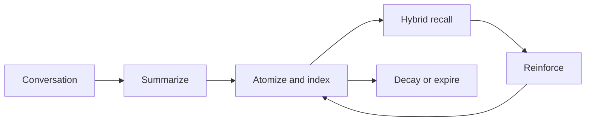

<a href="README.md">中文</a> &nbsp;/&nbsp; <strong>English</strong> &nbsp;/&nbsp; <a href="README_ru.md">Русский</a>

<h1>LivingMemory</h1>

<strong>Long-term memory for AstrBot that recalls with precision and evolves with every conversation.</strong>

CAPTURE &nbsp;&nbsp; RETRIEVE &nbsp;&nbsp; CONNECT &nbsp;&nbsp; EVOLVE

  
  
  
  

## Memory, with structure

<table>
<tr>
<td width="33%"><strong>PRECISE RECALL</strong>  BM25 and vector search run across document and graph routes, then converge through ranked fusion.</td>
<td width="33%"><strong>LIVING CONTEXT</strong>  Facts become independent memory atoms with importance, TTL, reinforcement, and temporal decay.</td>
<td width="33%"><strong>VISIBLE SCALE</strong>  Explore the complete relationship graph through a responsive canvas with communities and level of detail.</td>
</tr>
</table>

## One memory system

| Recall | Intelligence | Control |
| :--- | :--- | :--- |
| **Hybrid retrieval** Keyword and semantic search across two routes. | **Dual summaries** Facts and persona context remain independently useful. | **Safe operations** Backups, transactional deletion, and rebuild rollback. |
| **Agent-native tools** `recall_long_term_memory` and `memorize_long_term_memory`. | **Temporal graph** Confidence evolves as evidence accumulates or fades. | **Focused dashboard** Manage memory, debug recall, and inspect the full graph. |

## Recent capabilities

| Recoverable memory | Controlled boundaries | Online maintenance |
| :--- | :--- | :--- |
| **Sources and archives** Important memories can retain source messages for review and re-summarization; low-value memories can be archived and restored instead of deleted. | **Scopes and access control** Share memory by session, user, or globally, with explicit isolation, allowlists, and identity aliases. | **Safe index rebuilds** Startup checks and large repairs run in the background with batching, progress status, rollback, and shadow-index cutover. |

## Start in three moves

1. Install the plugin from the AstrBot plugin marketplace, or place it in `data/plugins`.
2. Reload AstrBot and open the LivingMemory configuration page.
3. Select the providers below; everything else has practical defaults.

| Setting | Purpose |
| :--- | :--- |
| `embedding_provider_id` | Embedding model; leave empty to use the AstrBot default. |
| `llm_provider_id` | Summarization model; leave empty to use the AstrBot default. |

Open the visual workspace at `Plugins -> LivingMemory -> Pages -> dashboard`. Plugin Pages requires **AstrBot 4.24.2 or later**.

## Go deeper

| Learn | Configure | Operate | Understand |
| :--- | :--- | :--- | :--- |
| [Quick start](https://lxfight-s-astrbot-plugins.github.io/astrbot_plugin_livingmemory/en/guide/getting-started) [Feature overview](https://lxfight-s-astrbot-plugins.github.io/astrbot_plugin_livingmemory/en/features) | [Configuration](https://lxfight-s-astrbot-plugins.github.io/astrbot_plugin_livingmemory/en/configuration) | [Commands](https://lxfight-s-astrbot-plugins.github.io/astrbot_plugin_livingmemory/en/commands) [WebUI guide](https://lxfight-s-astrbot-plugins.github.io/astrbot_plugin_livingmemory/en/webui) | [Architecture](https://lxfight-s-astrbot-plugins.github.io/astrbot_plugin_livingmemory/en/architecture) |

Upgrading from v1.4.0-v1.4.2? Review the [backup and migration settings](https://lxfight-s-astrbot-plugins.github.io/astrbot_plugin_livingmemory/en/configuration#backup-migration-and-cleanup) first.

## Project

[Documentation](https://lxfight-s-astrbot-plugins.github.io/astrbot_plugin_livingmemory/en/) · [Releases](https://github.com/lxfight-s-Astrbot-Plugins/astrbot_plugin_livingmemory/releases) · [Changelog](CHANGELOG.md) · [Issues](https://github.com/lxfight-s-Astrbot-Plugins/astrbot_plugin_livingmemory/issues)

Community support: [QQ group 953245617](https://qm.qq.com/cgi-bin/qm/qr?k=WdyqoP-AOEXqGAN08lOFfVSguF2EmBeO&jump_from=webapi&authKey=tPyfv90TVYSGVhbAhsAZCcSBotJuTTLf03wnn7/lQZPUkWfoQ/J8e9nkAipkOzwh) · Password: `lxfight`

LivingMemory is released under the [AGPL-3.0 license](LICENSE).
