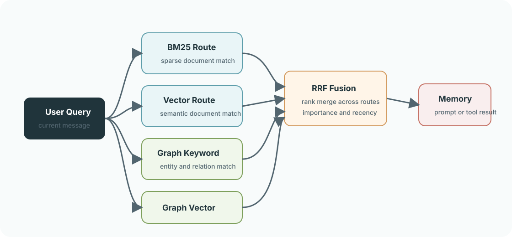
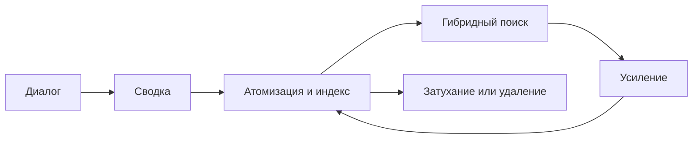

<a href="README.md">中文</a> &nbsp;/&nbsp; <a href="README_en.md">English</a> &nbsp;/&nbsp; <strong>Русский</strong>

<h1>LivingMemory</h1>

<strong>Долговременная память для AstrBot: точное извлечение и развитие с каждым диалогом.</strong>

СОХРАНЯТЬ &nbsp;&nbsp; ИЗВЛЕКАТЬ &nbsp;&nbsp; СВЯЗЫВАТЬ &nbsp;&nbsp; РАЗВИВАТЬ

  
  
  
  

## Память приобретает структуру

<table>
<tr>
<td width="33%"><strong>ТОЧНОЕ ИЗВЛЕЧЕНИЕ</strong>  BM25 и векторный поиск работают с документами и графом, а затем объединяют результаты в единый рейтинг.</td>
<td width="33%"><strong>ЖИВОЙ КОНТЕКСТ</strong>  Факты становятся независимыми атомами памяти с важностью, TTL, усилением и временным затуханием.</td>
<td width="33%"><strong>МАСШТАБ БЕЗ СКРЫТЫХ ДАННЫХ</strong>  Полный граф связей доступен на производительном холсте с сообществами и уровнями детализации.</td>
</tr>
</table>

## Единая система памяти

| Извлечение | Интеллект | Управление |
| :--- | :--- | :--- |
| **Гибридный поиск** Ключевые слова и семантика в двух контурах. | **Два вида сводок** Факты и контекст личности сохраняют отдельную ценность. | **Безопасные операции** Резервные копии, транзакционное удаление и откат. |
| **Инструменты для Agent** `recall_long_term_memory` и `memorize_long_term_memory`. | **Временной граф** Достоверность связей меняется по мере накопления и затухания свидетельств. | **Сфокусированная панель** Управление памятью, отладка поиска и просмотр полного графа. |

## Новые возможности

| Восстанавливаемая память | Управляемые границы | Обслуживание без остановки |
| :--- | :--- | :--- |
| **Исходные сообщения и архив** Для важных воспоминаний можно сохранить исходные сообщения, проверить их и повторно создать сводку; малоценные записи можно архивировать и восстанавливать. | **Области и контроль доступа** Память можно разделять по диалогу, пользователю или глобально, используя принудительную изоляцию, белые списки и псевдонимы. | **Безопасная перестройка индексов** Проверки и крупные исправления выполняются в фоне с пакетной обработкой, отображением прогресса, откатом и теневыми индексами. |

## Три шага для запуска

1. Установите плагин из каталога AstrBot или поместите его в `data/plugins`.
2. Перезапустите AstrBot и откройте страницу настроек LivingMemory.
3. Выберите два провайдера ниже; для остальных параметров заданы практичные значения.

| Параметр | Назначение |
| :--- | :--- |
| `embedding_provider_id` | Модель эмбеддингов; пустое значение использует стандартную модель AstrBot. |
| `llm_provider_id` | Модель для сводок; пустое значение использует стандартную модель AstrBot. |

Визуальная рабочая область: `Plugins -> LivingMemory -> Pages -> dashboard`. Для Plugin Pages нужен **AstrBot 4.24.2 или новее**.

## Подробнее

| Начало работы | Настройка | Команды | Архитектура |
| :--- | :--- | :--- | :--- |
| [Краткое руководство](https://lxfight-s-astrbot-plugins.github.io/astrbot_plugin_livingmemory/en/guide/getting-started) [Обзор функций](https://lxfight-s-astrbot-plugins.github.io/astrbot_plugin_livingmemory/en/features) | [Конфигурация](https://lxfight-s-astrbot-plugins.github.io/astrbot_plugin_livingmemory/en/configuration) | [Список команд](https://lxfight-s-astrbot-plugins.github.io/astrbot_plugin_livingmemory/en/commands) [Руководство WebUI](https://lxfight-s-astrbot-plugins.github.io/astrbot_plugin_livingmemory/en/webui) | [Устройство системы](https://lxfight-s-astrbot-plugins.github.io/astrbot_plugin_livingmemory/en/architecture) |

Обновляетесь с v1.4.0-v1.4.2? Сначала проверьте [настройки резервного копирования и миграции](https://lxfight-s-astrbot-plugins.github.io/astrbot_plugin_livingmemory/en/configuration#backup-migration-and-cleanup).

## Проект

[Документация](https://lxfight-s-astrbot-plugins.github.io/astrbot_plugin_livingmemory/en/) · [Релизы](https://github.com/lxfight-s-Astrbot-Plugins/astrbot_plugin_livingmemory/releases) · [История изменений](CHANGELOG.md) · [Сообщить о проблеме](https://github.com/lxfight-s-Astrbot-Plugins/astrbot_plugin_livingmemory/issues)

Поддержка сообщества: [QQ-группа 953245617](https://qm.qq.com/cgi-bin/qm/qr?k=WdyqoP-AOEXqGAN08lOFfVSguF2EmBeO&jump_from=webapi&authKey=tPyfv90TVYSGVhbAhsAZCcSBotJuTTLf03wnn7/lQZPUkWfoQ/J8e9nkAipkOzwh) · Пароль: `lxfight`

LivingMemory распространяется по [лицензии AGPL-3.0](LICENSE).
