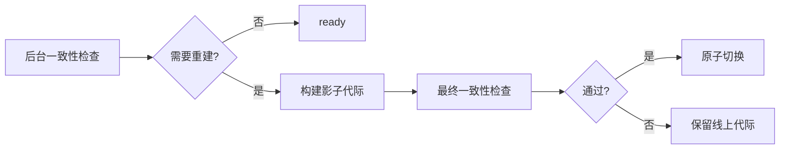

# 技术架构

LivingMemory 的运行时由事件钩子、记忆处理、检索融合、存储和 WebUI API 五个部分组成。它尽量把“自动记忆”和“主动工具”放在同一套数据模型上，避免两套记忆系统互相打架。

## 总体流程

1. AstrBot 收到消息后，`EventHandler` 捕获会话上下文。
2. 在 LLM 请求前，召回链路根据当前消息和最近上下文查询长期记忆。
3. 检索结果按配置注入到请求中，或作为 Agent 工具结果返回。
4. LLM 回复后，反思链路判断是否需要总结并写入新记忆。
5. 后台任务执行衰减、过期清理、备份和索引校验。

## 主要模块

| 模块 | 职责 |
| --- | --- |
| `main.py` | 注册插件、初始化核心组件、注册 Agent 工具和 Pages API |
| `core/plugin_initializer.py` | 非阻塞初始化、Provider 等待、数据库迁移、索引加载 |
| `core/event_handler.py` | 群聊捕获、记忆召回、记忆反思 |
| `core/managers/memory_engine.py` | 统一记忆写入、搜索、删除和索引维护 |
| `core/managers/graph_memory_manager.py` | 图谱节点、边、条目和图检索协调 |
| `core/managers/atom_lifecycle_manager.py` | 原子过期、遗忘、强化和生命周期维护 |
| `core/retrieval/` | BM25、向量、图谱、原子检索与 RRF 融合 |
| `storage/` | SQLite 存储、图谱存储、原子存储、数据库迁移 |
| `pages/dashboard/` | AstrBot Pages 管理界面 |

## 双路四模式检索

普通长期记忆和图谱记忆分别走两条路线：

| 路线 | 关键词模式 | 向量模式 |
| --- | --- | --- |
| 文档路 | `BM25Retriever` | `VectorRetriever` |
| 图谱路 | `GraphKeywordRetriever` | `GraphVectorRetriever` |

随后 `RRFFusion` 会融合多个排序列表，再叠加重要性、时间衰减、会话隔离和人格隔离等过滤条件。

## 后台索引维护

插件就绪与索引维护分离：初始化核心存储后，启动一致性检查会作为后台任务运行。即使有大量索引需要修复，插件也不会等待整库重建完成才进入可用状态。

| 阶段 | 设计 |
| --- | --- |
| 变化检测 | 保存 Embedding Provider 指纹；即使维度相同，Provider 或模型变化也会触发完整向量重建 |
| 文档与向量 | 分批读取，限制 Embedding 批量、并发、重试和请求间隔；完整向量重建保存检查点 |
| BM25 与 FAISS | 在影子代际构建，达到失败比例要求并通过检查后才切换 |
| 图谱 | active 记忆按主键流式构建到影子存储，重建期间的写入在切换前回放 |
| 收尾补偿 | 维护完成后再次检查一致性，并修复维护期间发生的并发变更 |
| 可观测性 | 状态通过 `MemoryEngine` 暴露，`/lmem status` 显示检查、重建、部分完成、失败或取消及进度 |

## 记忆数据模型

| 类型 | 说明 |
| --- | --- |
| 会话消息 | 原始对话上下文，用于触发总结和补充查询 |
| 记忆条目 | LLM 总结后的长期记忆，包含摘要、重要性、会话和人格元数据 |
| 图谱节点与边 | 从记忆中抽取的实体和关系，支持跨记忆合并 |
| 记忆原子 | 独立事实单元，拥有类型、TTL、衰减和访问强化状态 |

## 数据安全设计

插件在高风险操作前尽量留下恢复点：

| 场景 | 保护措施 |
| --- | --- |
| 插件版本变化 | 启动时自动创建版本标记备份 |
| 数据库迁移 | 迁移前备份 |
| 索引重建 | 分批构建影子代际，失败保留线上数据，成功后原子切换并执行并发写入补偿 |
| 删除记忆 | 使用事务保护相关记录 |
| 管理页面操作 | 通过 Pages API 复用运行时组件，避免绕过 MemoryEngine |
